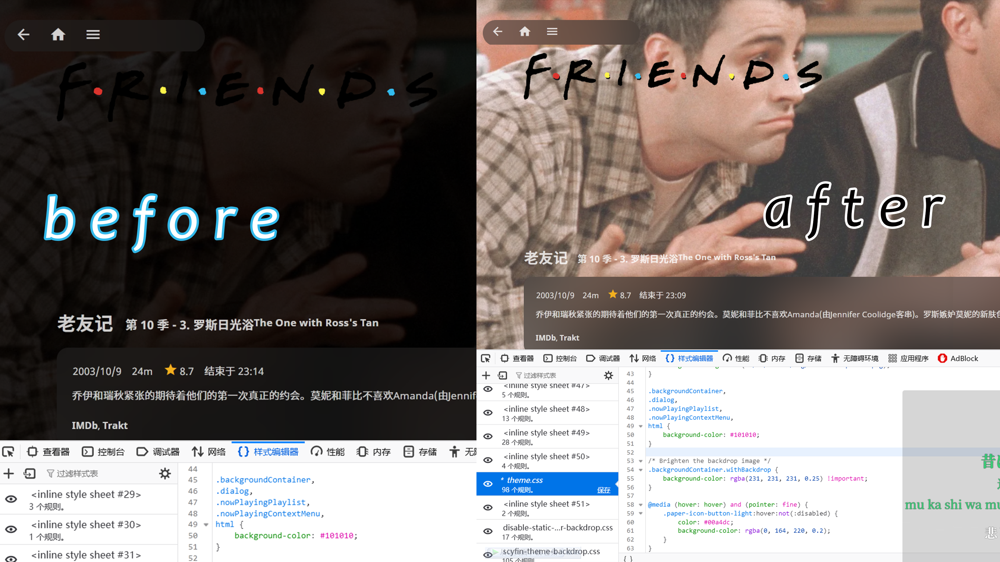
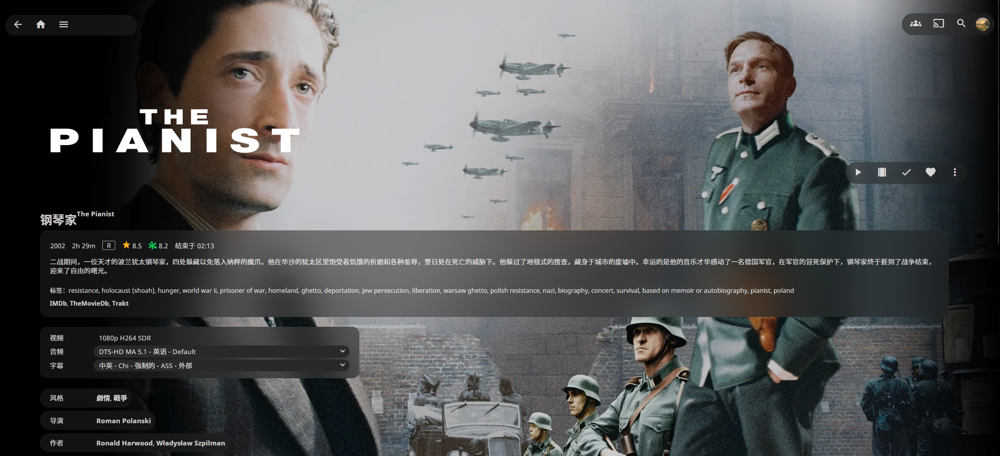
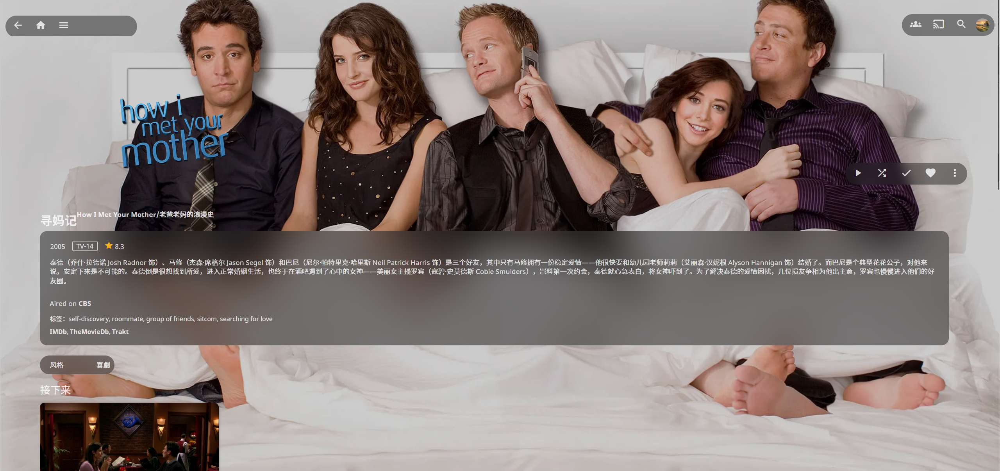
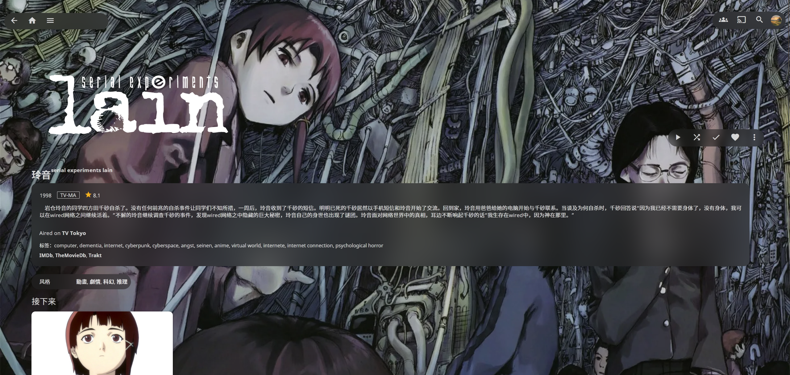

<h1 align="center">Jellyfin Plugin Manifest Plugin</h1>
<h3 align="center">Part of the <a href="https://jellyfin.media">Jellyfin Project</a></h3>

<p align="center">
Manifest for Jellyfin plugins

</p>

## Use Guide

1. In jellyfin, go to dashboard -> plugins -> Repositories -> add and paste this link 
```
https://cdn.jsdelivr.net/gh/tanmoumou252/JellyfinPluginManifest.cdn@master/manifest.json
```
2. Go to Catalog and search for the plugin you want to install
3. Click on it and install
4. Restart Jellyfin
5. as shown  


## Current Plugins
1. <a href = "https://github.com/danieladov/jellyfin-plugin-mergeversions"> Merge Versions</a>
2. <a href = "https://github.com/danieladov/jellyfin-plugin-skin-manager"> Skin Manager</a>
3. <a href = "https://github.com/danieladov/jellyfin-plugin-themesongs"> Theme Songs</a>

## Changelog
1. Replacing ```GitHub url``` with ```cdn.jsdelivr``` to speed up web access
2. Re-upload ```Assets``` under ```Releases``` to a download mode that ```cdn.jsdelivr``` can support - ```repositories```, this [issue](https://github.com/jsdelivr/jsdelivr/issues/18203#issue-595621516) has been discussed long ago

<h1 align="center">Jellyfin-web skin $\color{#FF0000}{SCYFIN}$</h1> 
<h3 align="center"><a  href="https://github.com/loof2736/scyfin">Scyfin</a> is an eye pleasing custom skin for jellyfin!</h3> 

## $\color{#FF0000}{Changelog}$ 

  

1. Reduce some rounded corners 
2. fine-tune the position of logos on tvshow and movie detail pages 
3. increase backdrop brightness 


## $\color{#ce8f4d}{Useage}$ 

Copy and paste into `Console` - `General` - `Custom CSS Code` 

### without backdrop 
```
@import url('https://cdn.jsdelivr.net/gh/tanmoumou252/JellyfinPluginManifest.cdn@master/scyfin/scyfin-theme.css'); 
``` 
Options (Add these below the full theme)  

Disable static left drawer 

```
    @import url('https://cdn.jsdelivr.net/gh/tanmoumou252/JellyfinPluginManifest.cdn@master/scyfin/disable-static-drawer.css'); 
```  

Disable static left drawer (BACKDROP VERSION)   

```    
    @import url('https://cdn.jsdelivr.net/gh/tanmoumou252/JellyfinPluginManifest.cdn@master/scyfin/disable-static-drawer-backdrop.css'); 
``` 
### backdrop 

```
@import url('https://cdn.jsdelivr.net/gh/tanmoumou252/JellyfinPluginManifest.cdn@master/scyfin/scyfin-theme-backdrop.css'); 
``` 

Options (Add these below the full theme) 

Disable static left drawer 

``` 
    @import url('https://cdn.jsdelivr.net/gh/tanmoumou252/JellyfinPluginManifest.cdn@master/scyfin/disable-static-drawer.css'); 
``` 

Disable static left drawer (BACKDROP VERSION) 

``` 
    @import url('https://cdn.jsdelivr.net/gh/tanmoumou252/JellyfinPluginManifest.cdn@master/scyfin/disable-static-drawer-backdrop.css'); 
``` 

## $\color{#ce8f4d}{Skin Demo}$



 

<h1 align="center">Version control of Manifest</h1>
<h3>I have to say, as a noob, this looks a little weird, but still very funny.</h3>

With the help of <a href="https://github.com/Xhofe/alist">AList</a>, I was able to test whether ```manifest.json``` is supported by jellyfin more quickly by using webdav's method of mounting the file locally.  

1. Normal recognition without kodi plugin  
```
https://cdn.jsdelivr.net/gh/tanmoumou252/JellyfinPluginManifest.cdn@0b51efa/manifest.json
```
2. Kodi added but not recognized  
```
https://cdn.jsdelivr.net/gh/tanmoumou252/JellyfinPluginManifest.cdn@d0b5e24/manifest.json
```
3. fallback Exactly the same as @0b51efa  
```
https://cdn.jsdelivr.net/gh/tanmoumou252/JellyfinPluginManifest.cdn@01a6538/manifest.json
```
5. Unify tab indentation to spaces instead of tabs not recognized  
```
https://cdn.jsdelivr.net/gh/tanmoumou252/JellyfinPluginManifest.cdn@a643621/manifest.testthumb.json
```
7. Single plugin tests recognize thumb successfully.
```
https://cdn.jsdelivr.net/gh/tanmoumou252/JellyfinPluginManifest.cdn@de632af/manifest.testthumb.json
```
8. Official jellyfin plugin manifest  
```
https://cdn.jsdelivr.net/gh/tanmoumou252/JellyfinPluginManifest.cdn@master/manifest-jellyfin-repo.json
```
